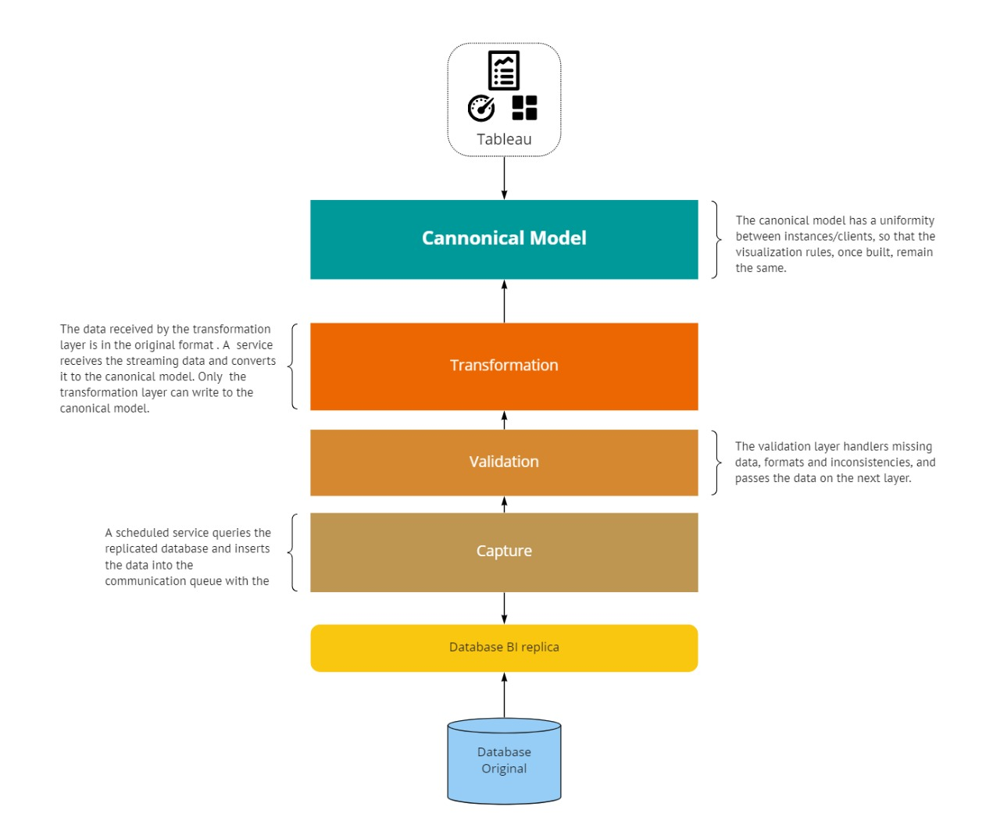

# Siemens Healthineers Architecture

## Visualization Layer

The visualization layer is responsible for the calculation and display rules, querying from the canonical model with standardized and consistent data, being necessary to implement each tool.

## Canonical Model Layer

The canonical model represents the standardized format of the data that will be displayed by the visualization tools, so that the rule of calculation and presentation is always uniform. In this layer the data is already processed and validated, being the main source of data.

## Transformation Layer

The transformation layer is responsible for receiving valid and unstructured data, making a transformation from the original structure to a standardized and canonical structure. It is at this stage that the conversion rules are applied, being partially implemented in each client, depending on the adherence of the original data in relation to the canonical model.

## Validation Layer

The validation layer is responsible for handling unfilled data, inconsistent formats and common system rules. This stage is partially implemented in each client until a consistent validation base is created, after validation, the data will be sent to the transformation layer.

## Capture Layer

The capture components consist of retrieving data from different sources of data sources and structure, always respecting the data structure of the source source. This stage is implemented for each client and origin, after retrieval, the data is sent to the transformation layer.